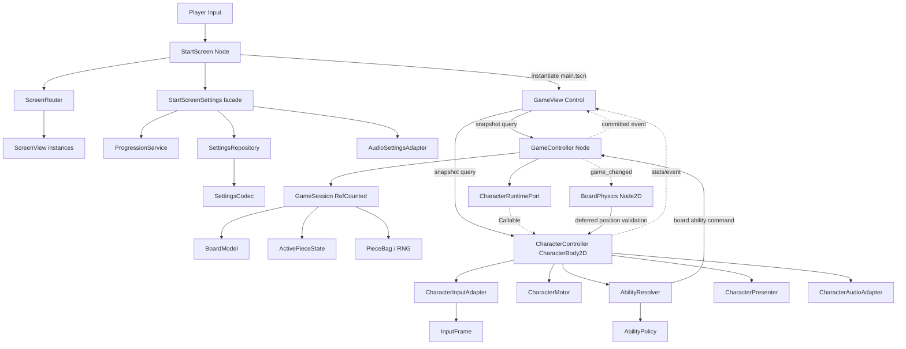
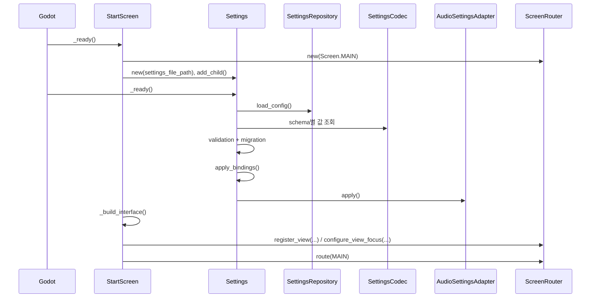
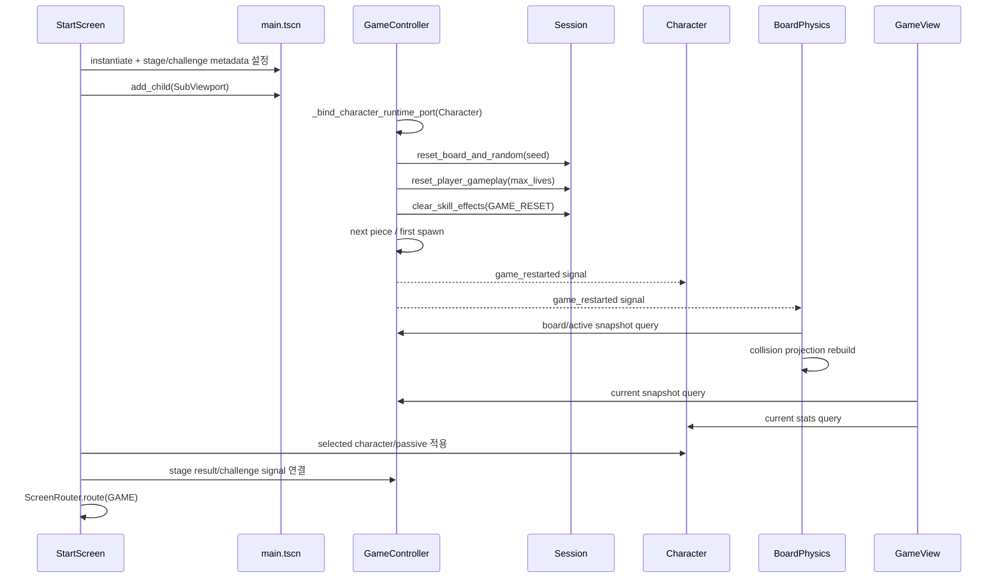
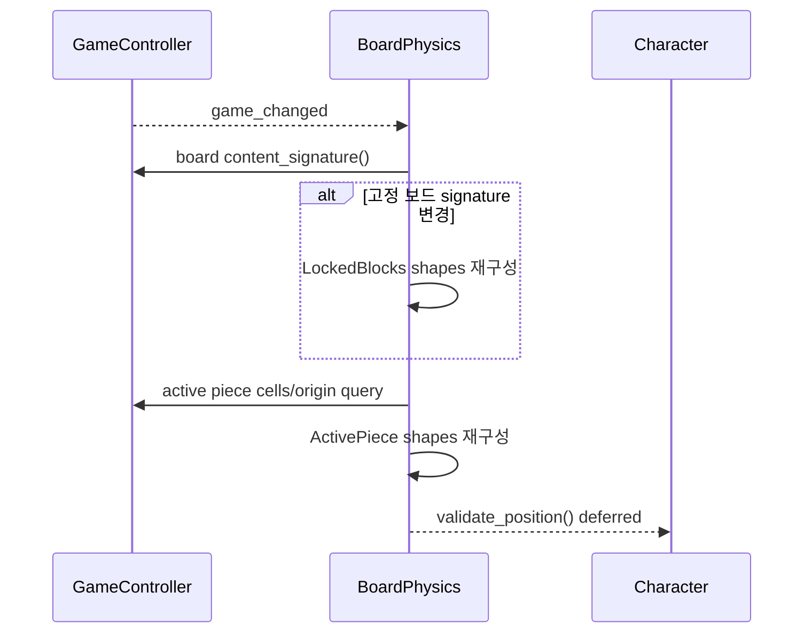
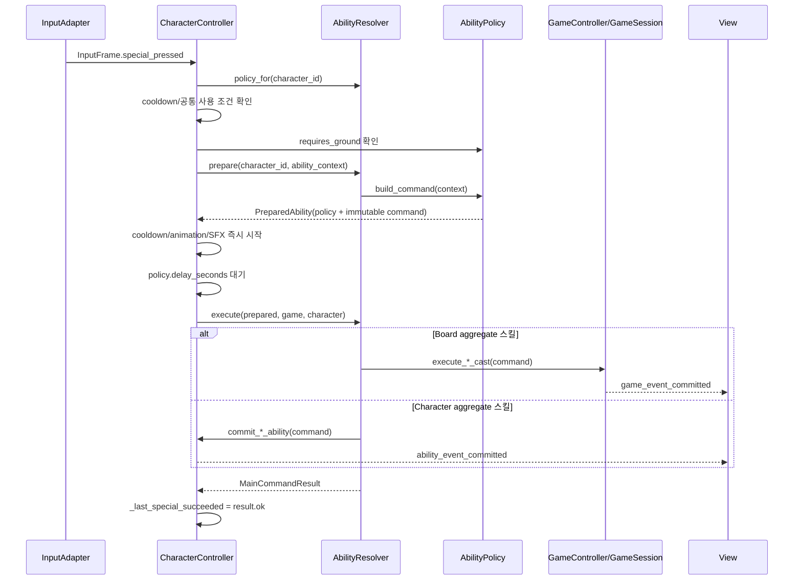
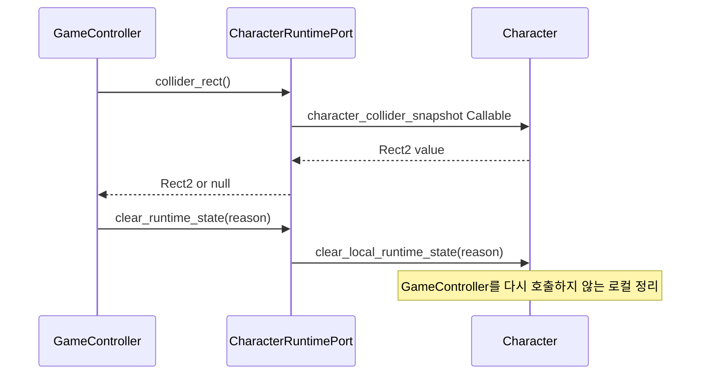
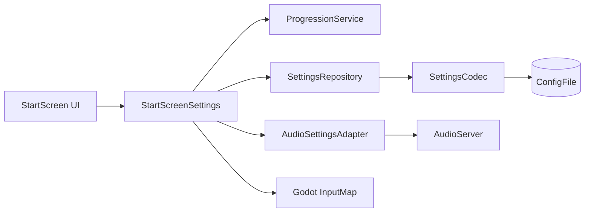
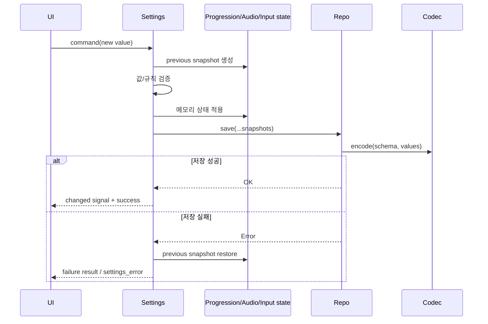
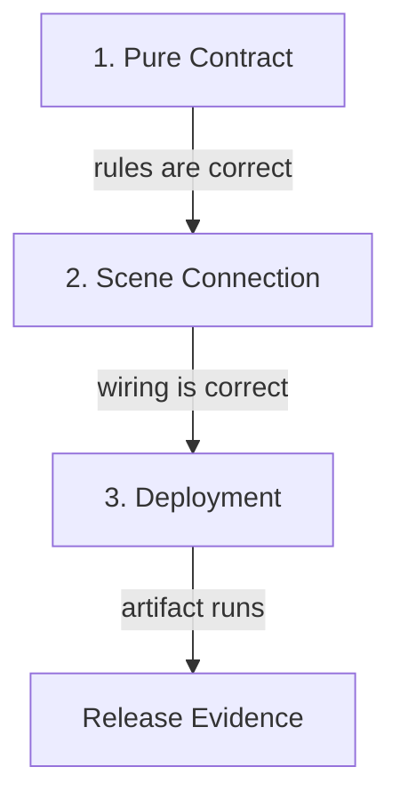

# Block Fighter ver.1.0.2 최종 아키텍처 연결 명세

작성 기준: 2026-09-04
대상 프로젝트: `ver.1.0.2`
목적: 최종 구조의 상태 소유권, 호출 방향, Scene 연결, 명령·사건·View 투영 방식을 한 문서에서 추적한다.

이 문서는 클래스가 몇 개인지를 설명하는 목록이 아니다. 다음 질문에 답하는 실행 가능한 구조 지도다.

1. 각 상태의 원본은 어디에 있는가?
2. 누가 명령을 만들고 누가 검증·커밋하는가?
3. 실패하면 무엇이 그대로 유지되는가?
4. 성공 뒤 어떤 사건이 누구에게 전달되는가?
5. View와 Physics는 어떻게 원본을 복제하지 않고 현재 상태를 표시하는가?
6. 새 화면·스킬·설정·테스트를 어디에 추가해야 하는가?

---

## 1. 한 문장 아키텍처

> Godot Scene Shell + RefCounted GameSession + Command/Result/Event + Snapshot Projection + Ports/Adapters

- Godot `Node`는 SceneTree 수명, physics frame, Input, signal, AudioServer, ConfigFile 같은 엔진 경계를 담당한다.
- `RefCounted` 도메인 객체는 보드·피스·진행 상태와 원자적으로 지켜야 하는 규칙을 담당한다.
- 쓰기는 Command로 요청하고, 성공/실패는 Result로 돌려받으며, 성공한 사실은 Event로 알린다.
- View와 Physics는 원본 상태를 장기간 복제하지 않고 필요한 시점에 Snapshot을 읽어 투영한다.
- 구체 Node가 반대편 구현을 직접 파고들지 않도록 좁은 Port/Adapter를 둔다.

---

## 2. 전체 계층과 의존 방향



### 2.1 의존 규칙

허용되는 방향은 다음과 같다.

```text
View/Physics/Character Scene Shell
            ↓
     GameController facade
            ↓
        GameSession
            ↓
 BoardModel / ActivePiece / PieceBag
```

다음 방향은 금지한다.

```text
GameSession → GameView                 금지
GameSession → SceneTree/Input/Audio    금지
GameView → Session private state 쓰기  금지
BoardPhysics → 보드 규칙 커밋          금지
GameController → Character private 함수 금지
```

`GameController`가 캐릭터 상태를 꼭 알아야 하는 경우에는 `MainCharacterRuntimePort`의 좁은 Callable만 사용한다.

---

## 3. 실제 Scene 객체 그래프

### 3.1 애플리케이션 시작 Scene

`project.godot`의 `run/main_scene`은 `res://start_screen/scenes/start_screen.tscn`이다.

```text
StartScreen : Control
└─ script: BlockFighterStartScreen
   ├─ 런타임 생성: StartScreenSettings
   ├─ 런타임 생성: MusicManager
   ├─ 런타임 생성: 선택 SFX player/timer
   ├─ 런타임 생성: 각 메뉴 화면 Control
   ├─ RefCounted: ScreenRouter
   └─ GAME 진입 시 생성: main.tscn → SubViewport 아래 Game 인스턴스
```

StartScreen Scene 자체는 얇다. 실제 메뉴 Control 조립은 `start_screen.gd`의 builder들이 담당하며, 화면 전환 상태는 `ScreenRouter`, 진행도와 저장은 Settings 하위 서비스가 담당한다.

### 3.2 게임 Scene

`res://scenes/main.tscn`의 실제 노드 구조는 다음과 같다.

```text
Main : Control                         ← MainGameView
├─ GameController : Node              ← MainGameController
└─ BoardPhysics : Node2D              ← MainBoardPhysics
   ├─ Boundaries : StaticBody2D
   ├─ LockedBlocks : StaticBody2D
   ├─ ActivePiece : AnimatableBody2D
   └─ Character : CharacterBody2D      ← MainCharacterController
      ├─ Collider : CollisionShape2D
      ├─ CrushSensor : ShapeCast2D
      ├─ Sprite : Sprite2D
      ├─ LeftRay : RayCast2D
      └─ RightRay : RayCast2D
```

`Main`은 화면을 그리지만 게임 규칙의 원본이 아니다. `GameController`는 Scene 수명과 규칙 모델의 다리이고, `BoardPhysics`는 논리 보드를 충돌체로 다시 만드는 projection이다.

---

## 4. 상태 소유권 지도

| 상태 | 원본 소유자 | 변경 경계 | 외부 조회 방식 |
|---|---|---|---|
| 고정 블록, 얼음 metadata | `MainGameSession.board_state` | `BoardModel`의 검증된 mutation | `GameController.board`, board snapshot |
| 활성 피스 타입·회전·원점·남은 셀 | `MainActivePieceState` | `GameController`의 이동·회전·lock 흐름 | active piece snapshot/query |
| 다음 피스와 bag | `MainGameSession.piece_queue` | spawn/reset 흐름 | Controller 호환 query |
| spawn 난수 | `GameSession.spawn_random` | spawn 후보 선택 | Controller 내부 사용 |
| 기믹 난수와 확률 누적 | `GameSession.gimmick_random` 및 기믹 필드 | stage gimmick advance | Controller snapshot/query |
| 점수·레벨·삭제 줄·스테이지 시간 | `MainGameSession` | lock/line clear/stage timer | progress snapshot/query |
| 보스 HP·전환 timer·씨앗·고드름 | `MainGameSession` | GameController boss/gimmick orchestration | Controller query, View draw |
| 생명·회전 cooldown·특수 cooldown | `MainGameSession` private backing state | player resource commands | Controller query, Character forwarding property |
| 소방관 물길 셀·방향·수명 | `MainGameSession` private backing state | firefighter cast/clear/advance | 복제된 water snapshot + 값 query |
| 방패 셀·방향·수명 | `MainGameSession` private backing state | shield cast/clear/advance | 복제된 blocker snapshot + 값 query |
| 시계공 현재/미래 기믹 정지 시간 | `MainGameSession` private backing state | clock cast/clear/advance | Controller 값 query |
| 캐릭터 위치·velocity | Godot `CharacterBody2D` | CharacterController + CharacterMotor | Character query |
| 매달림 런타임 상태 | `MainCharacterMotor` | hang/movement 흐름 | Character forwarding property |
| 일반인 질주 | `MainCharacterController` | local ability commit/timer | `sprint_remaining()` |
| 성녀/요리사 강화와 1회 방어 | `MainCharacterController` | local ability commit/consume/timer | `chef_meat_remaining()` 등 |
| 닌자 투사체 비행·충돌 표시 상태 | `MainCharacterController` | ninja projectile advance | typed `MainNinjaProjectileSnapshot` |
| 애니메이션 상태·시간 | `MainCharacterPresenter` | Character visual update | Presenter/Character query |
| 물길 등장 pulse | `MainGameView` | committed event 수신 | View 내부 표현 상태 |
| 스테이지 최고 별·무피해·재화·패시브 | `BlockFighterProgressionService` | progression commands | detached snapshot/query |
| 오디오 percent | `BlockFighterAudioSettingsAdapter` | audio setting commands | audio snapshot/query |
| ConfigFile section/key 규약 | `BlockFighterSettingsCodec` | encode/decode helper | Settings/Repository 사용 |
| 설정 파일 경로·load/save | `BlockFighterSettingsRepository` | repository I/O | Settings facade |

### 4.1 중요한 해석

`GameController`에는 기존 Scene과 테스트를 위한 forwarding property가 남아 있다. 그러나 생산 코드에서 실제 `MainGameSession` 객체는 `_session`으로 비공개이며, 외부 Node가 Session을 통째로 받아 변경하지 않는다.

`GameSession.board_state`와 일부 진행 필드는 Session 내부에서 직접 다룰 수 있는 mutable 값이다. 순수 계약 테스트에서는 이를 fixture로 사용한다. 생산 경로에서는 비공개 `_session`을 가진 `GameController`가 이 접근을 감싼다.

---

## 5. 초기화 연결 순서

### 5.1 메뉴 시작



### 5.2 게임 시작



Node의 `_ready()` 실제 호출 순서에 규칙 정확성을 맡기지 않는다. 각 객체는 필요한 signal을 연결하고 즉시 현재 snapshot을 동기화하므로 늦게 연결되어도 현재 화면과 충돌체를 재구성할 수 있다.

---

## 6. physics frame 실행 구조

`GameController`와 `CharacterController`는 각각 Godot physics callback을 갖는다. 둘의 책임은 다르다.

### 6.1 GameController frame

```text
_physics_process(delta)
├─ restart 입력 → reset_game() 후 종료
├─ pause 입력 → toggle_pause()
├─ BOSS_FALLING → boss fall 전용 advance
├─ BOSS_DYING → boss dying 전용 advance
├─ PLAYING 아니면 종료
├─ GameSession.advance_water_path(real delta)
├─ GameSession.advance_barrier(real delta)
├─ 시계공 freeze가 활성인가?
│  ├─ GameSession.advance_clockmaker(real delta)
│  ├─ 현재 낙하/lock은 진행하지 않음
│  ├─ future gimmick freeze 규칙에 따라 gimmick advance
│  └─ stage timer는 real delta로 진행
└─ 일반 진행
   ├─ meditation이면 피스용 effective_delta에 배율 적용
   ├─ gravity advance
   │  ├─ 자동 낙하 단계 직전 water slide 1회
   │  └─ 아래 한 셀 이동 또는 중지
   ├─ lock delay advance
   ├─ stage gimmick advance(real delta)
   └─ stage timer advance(real delta)
```

시간축의 핵심은 다음과 같다.

- pause 상태에서는 GameController가 PLAYING 분기를 실행하지 않으므로 물길·방패·시간정지 시간도 멈춘다.
- 명상 배율은 피스 중력과 lock에 쓰는 `effective_delta`에만 적용한다.
- 물길·방패·시계공·스테이지 시간은 실제 `delta`를 사용한다.
- 시계공 freeze 중 피스 낙하와 lock은 멈추지만 물길은 계속 감소한다.

### 6.2 CharacterController frame

```text
_physics_process(delta)
├─ CharacterInputAdapter.capture() → InputFrame
├─ 게임이 PLAYING이 아니면 캐릭터 정지 후 종료
├─ 캐릭터 로컬 timer 감소
├─ 닌자 projectile advance
├─ 속박 중이면 binding만 진행 후 공통 후처리
├─ special input 처리
│  └─ AbilityResolver/Policy 흐름
├─ 자력 재스폰 hold 처리
├─ 명상 유지/진입 처리
├─ 기본 공격 처리
├─ 매달림이면 hanging branch
└─ 아니면 normal movement branch
   ├─ facing/ground/coyote 갱신
   ├─ CharacterMotor로 수평 속도·중력 적용
   ├─ jump/rotation/grab 처리
   └─ CharacterMotor.move(self) → move_and_slide()

공통 후처리
├─ 지연된 punch 판정
├─ Presenter로 animation/Sprite 투영
└─ 보드 경계·겹침 validate_position()
```

CharacterController는 흐름 조정자다. 입력 원본, 이동 적분, 스킬 정책, Sprite 조작, SFX player 생성은 각각의 협력 객체에 위임한다.

---

## 7. BoardPhysics의 역할

`MainBoardPhysics`는 규칙을 결정하지 않는다. 논리 상태를 Godot collision object로 투영한다.



- 고정 보드가 바뀌지 않았다면 signature cache로 고정 collider 재생성을 피한다.
- 활성 피스 collider는 현재 원점과 셀로 동기화한다.
- collision 반영이 끝난 뒤 캐릭터 위치 검증을 deferred로 호출한다.
- Physics가 보드 셀을 직접 바꾸거나 점수·스테이지를 계산하지 않는다.

---

## 8. Command → Result → Event 계약

### 8.1 값 객체

#### `MainAbilityCastCommand`

입력이 받아들여진 순간의 의도를 보관한다.

- `ability_id`
- `origin_position`
- `start_cell`
- `direction`
- `cells`의 복제본

#### `MainFirefighterCastCommand`

소방관에게 필요한 최소 문맥만 보관한다.

- `start_cell`
- `direction`

최대 3칸과 4초는 플레이 규칙이므로 Command에 넣지 않는다.

#### `MainCommandResult`

- `ok`: 성공 여부
- `code`: 호출자가 분기할 안정적인 코드
- `message`: 진단용 설명
- `events`: 실제로 커밋된 사건의 복제 목록

실패 Result의 `events`는 항상 비어 있다.

#### `MainGameEvent`

커밋 완료 뒤의 사실을 표현한다.

- 종류: ability/water commit, clear, consume, ninja impact
- `ability_id`
- 복제된 셀 목록
- 방향, 지속시간, 실제 변경량
- 기존 효과 교체 여부
- 제거 이유
- 충돌 위치·접촉 종류·성공 여부

### 8.2 보드 스킬의 고정 커밋 순서

```text
1. Command 구조와 현재 game state 검증
2. 현재 authoritative Board/Character snapshot으로 전체 후보 계산
3. 실패하면 Result.failed 반환
   - 기존 상태 유지
   - Event 없음
   - game_changed 없음
4. 성공하면 관련 상태를 한 번에 커밋
5. MainGameEvent 생성
6. game_event_committed(event) emit
7. game_changed emit
8. 호출자에게 Result 반환
```

Event subscriber가 호출되는 시점에는 이미 상태가 커밋되어 있다. subscriber가 Controller snapshot을 다시 읽으면 Event와 같은 최종 상태를 본다.

### 8.3 제거와 만료

```text
advance(delta)
├─ 효과 없음 → no_active_effect, Event 없음
├─ 아직 남음 → ok, Event 없음
└─ 0 이하 도달
   ├─ 셀·방향·수명을 한 번에 빈 상태로 변경
   └─ EXPIRED clear Event 정확히 1개
```

이미 비어 있는 효과를 다시 advance/clear해도 제거 사건이 중복 발생하지 않는다.

---

## 9. 캐릭터 특수 스킬 공통 연결



시전 입력이 접수되면 cooldown·특수 자세·SFX가 즉시 시작된다. 지연 뒤 규칙 검증이 실패해도 기존 게임 규칙대로 cooldown은 환불하지 않는다.

### 9.1 정책 registry

| 캐릭터 ID | 지연 | 접지 필요 | Command에 고정하는 의도 | 커밋 소유자 |
|---|---:|---:|---|---|
| `normal` | 0.0초 | 아니오 | ability ID | CharacterController |
| `boxer` | 0.25초 | 아니오 | 시전 위치, 방향, 전방 후보 셀 | GameController + Board |
| `shield_guard` | 0.25초 | 아니오 | 시전 위치, 방향, 보호벽 후보 셀 | GameSession |
| `firefighter` | 0.6초 | 예 | 최초 전방 셀, 방향 | GameSession |
| `cleaner` | 0.4초 | 예 | 발밑 중심 셀 | GameController + Board |
| `chef` | 0.3초 | 아니오 | ability ID | CharacterController |
| `clockmaker` | 0.4초 | 아니오 | ability ID | GameSession |
| `ninja` | 0.25초 | 아니오 | 발사 위치, 보드 행, 방향 | CharacterController + impact 시 GameController |

### 9.2 스킬별 세부 경계

#### 일반인

```text
commit_normal_ability
→ CharacterController._sprint_remaining = 2초
→ ABILITY_COMMITTED(normal)
→ Character 이동속도 계산에 반영
→ 로컬 timer 만료 시 ABILITY_CLEARED(EXPIRED)
```

캐릭터 몸의 이동 배율이므로 Character aggregate가 소유한다.

#### 복서

```text
입력 시 전방 후보 고정
→ 0.25초 뒤 최신 Board에서 노출 대상 재검증
→ push_front_target()
→ 현재 CharacterRuntimePort collider snapshot을 보드 셀로 변환
→ 활성/고정 피스가 현재 캐릭터 셀을 침범하면 이동 중지
→ 실제 이동 거리 amount와 함께 ABILITY_COMMITTED(boxer)
```

후보는 입력 의도지만, 점유와 충돌 가능성은 커밋 시점의 세계 상태다.

#### 방패병

```text
입력 시 세로 3셀 후보와 방향 고정
→ GameSession이 현재 Board와 active cells 검사
→ 실제로 비어 있는 셀만 available로 계산
→ cells + direction + 2초를 원자 커밋
→ can_place_active()가 transient blocker로 사용
→ 만료 시 세 값을 한 번에 제거
```

#### 소방관

```text
입력 시 start_cell + direction 고정
→ 0.6초 뒤 GameSession.execute_firefighter_cast
→ 최신 Board를 따라 중력으로 내려가며 최대 3칸 후보 계산
→ 후보가 비면 path_blocked
→ 성공 시 cells + direction + 4초를 한 번에 교체
→ 기존 물길이 있어도 중간 clear 상태 없이 replaced_existing=true 사건 1개
→ 자동 낙하 단계 직전에 물길에 닿은 활성 피스를 옆으로 1회 이동 시도
→ 4초 뒤 EXPIRED 사건 1개
```

#### 청소부

```text
입력 시 발밑 중심 셀 고정
→ 중앙, 왼쪽, 오른쪽 순서로 최신 Board 검사
→ 위에 고정/활성 블록이 없는 노출 고정 블록만 제거
→ BoardMutationReceipt에 실제 제거된 셀만 기록
→ receipt.cells와 receipt.count로 ABILITY_COMMITTED(cleaner)
```

사건에는 시도한 후보가 아니라 실제로 변경된 셀만 들어간다.

#### 성녀/요리사 슬롯(`chef`)

```text
commit_chef_ability
→ 3초 이동 강화 + 1회 기믹/가시 방어를 함께 활성화
→ ABILITY_COMMITTED(chef)
→ 방어 사용 시 ABILITY_CONSUMED(chef)
→ 남은 이동 강화는 계속 유지
→ 3초 만료 시 ABILITY_CLEARED(EXPIRED)
```

캐릭터 속도와 피해 소비 불변식이므로 Character aggregate가 소유한다.

#### 시계공

```text
GameSession.execute_clockmaker_cast
→ fall_freeze_remaining = 3초
→ future_gimmick_freeze_remaining = 3초
→ 두 값을 한 번에 커밋
→ 현재 피스 낙하/lock 정지
→ 정한 기믹 시간축 규칙 적용
→ 두 값이 함께 0이 되면 EXPIRED 사건 1개
```

#### 닌자

```text
입력 시 발사 위치·행·방향 고정
→ 0.25초 뒤 CharacterController가 projectile 시작
→ 매 physics frame sweep rectangle로 최신 Board 충돌 검사
→ 고정 블록: impact만 기록, 블록 이동 없음
→ 활성 피스: impact 순간 현재 캐릭터 금지 셀을 다시 계산하고 1칸 push 시도
→ NINJA_PROJECTILE_IMPACTED(position/contact/succeeded)
→ GameView는 typed NinjaProjectileSnapshot을 draw당 한 번만 읽어 표시
```

캐릭터 충돌 금지 셀을 입력 시점에 저장하지 않는다. 캐릭터가 투사체 비행 중 이동할 수 있으므로, 충돌 커밋 직전 현재 collider로 다시 계산해야 한다.

---

## 10. CharacterController 내부 역할 분리

| 구성 요소 | 담당 | 담당하지 않는 것 |
|---|---|---|
| `MainCharacterController` | physics frame 조정, 상태 전환 순서, engine collision query, 캐릭터 로컬 능력 커밋 | 전역 Input 직접 읽기, SFX player 생성, Sprite 저수준 조작, 캐릭터별 거대 match |
| `MainCharacterInputAdapter` | Godot `Input`에서 캐릭터 action을 읽음 | 규칙 검증, 이동 |
| `MainCharacterInputFrame` | 한 physics frame 입력 snapshot | 다음 frame 상태 보존 |
| `MainCharacterMotor` | `move_and_slide`, 속도 접근, 중력, 위치 clamp, 매달림 runtime state | 스킬·점수·보드 변경 |
| `MainCharacterAbilityResolver` | character ID→policy registry, command 준비와 실행 연결 | 지속 효과 상태 소유 |
| `MainCharacterAbilityPolicy` | 시전 지연, 접지 조건, command builder, executor Callable | SceneTree/렌더링 |
| `MainCharacterPresenter` | atlas frame, Sprite geometry, facing, rotation, modulate, visible | gameplay 규칙 |
| `MainCharacterAudioAdapter` | SFX player 생성·재생·중지·명상 loop | cooldown/피해 판단 |

`CharacterController`가 여전히 큰 이유는 실시간 CharacterBody2D의 충돌 query, 점프·매달림·압착·재스폰 상태 전환 순서를 한 곳에서 조정하기 때문이다. 분리 기준은 줄 수가 아니라 변경 이유다.

---

## 11. CharacterRuntimePort 연결

`GameController`가 `CharacterController` 구체 타입이나 `_character_collider_rect()` 같은 private 함수에 의존하지 않도록 다음 포트를 만든다.

```text
MainCharacterRuntimePort
├─ get_max_lives Callable
├─ get_collider_rect Callable
├─ get_bound Callable
├─ apply_binding Callable
├─ take_hazard_damage Callable
└─ clear_local_runtime Callable
```



전체 reset에서 `GameController → Port → Character local reset → GameController clear` 순환이 생기지 않는다. 게임 효과 정리는 GameController/Session이 한 번만 수행한다.

---

## 12. View와 Event/Signal 연결

### 12.1 구독 관계

`MainGameView`는 다음 신호를 구독한다.

| 발행자 | signal | View 반응 |
|---|---|---|
| GameController | `game_changed` | label 갱신과 redraw 요청 |
| GameController | `game_event_committed(event)` | 물길 pulse 시작/정리, redraw |
| GameController | `boss_attacked` | 보스 공격/피격 VFX 시작 |
| CharacterController | `stats_changed` | 생명·stamina·cooldown UI 갱신 |
| CharacterController | `ability_event_committed(event)` | 캐릭터 스킬 VFX redraw |
| CharacterController | `binding_started/ended` | 속박 표시 갱신 |

### 12.2 Snapshot과 Event의 차이

```text
Snapshot = 지금 무엇이 존재하는가
Event    = 방금 무엇이 일어났는가
```

물길 예시:

```text
Session 원본
  [(6,21), (7,21), (8,21)], direction=1, remaining=3.4

View draw
  water_path_snapshot() 복제본을 한 번 받음
  → 현재 frame을 그림
  → 장기 상태로 보관하지 않음

Event
  FIREFIGHTER_WATER_COMMITTED
  → 짧은 등장 pulse만 시작
```

View가 Event 연결 전에 만들어지거나 Event를 놓쳐도 다음 draw에서 Snapshot만 읽으면 현재 물길을 복원한다. 놓칠 수 있는 것은 pulse 같은 일시 표현뿐이다.

복제본을 반환하는 것은 두 번째 원본을 만드는 일이 아니다. 호출자가 원본 배열을 변경하지 못하게 하는 읽기 경계다. View가 그 복제본을 장기간 상태로 저장하지 않기 때문에 authoritative truth는 하나다.

### 12.3 BoardPhysics도 같은 원칙을 사용한다

BoardPhysics는 현재 보드와 활성 피스를 읽어 collider를 만든다. collider는 물리 projection이지 규칙 원본이 아니다. Scene이 재생성되면 Controller의 현재 상태만으로 collider 전체를 다시 만들 수 있다.

---

## 13. Signal 목록과 의미

### 13.1 GameController

| signal | 의미 |
|---|---|
| `game_changed` | 현재 상태 snapshot을 다시 읽어야 함 |
| `game_event_committed(event)` | 규칙 상태 커밋 뒤 발생한 typed 사실 |
| `game_restarted` | 전체 run 상태가 재초기화됨 |
| `active_piece_descended(previous, current)` | 자동 낙하 한 단계가 완료됨 |
| `lines_cleared` | 행 삭제가 커밋됨; SFX 등 반응 가능 |
| `stage_cleared(lines)` | 스테이지 성공 |
| `stage_failed` | 시간/게임 규칙상 실패 |
| `boss_attacked` | 직접 공격과 보스 반격 연출 계기 |

### 13.2 CharacterController

| signal | 의미 |
|---|---|
| `stats_changed` | 캐릭터 query를 다시 읽어야 함 |
| `binding_started` | 속박 표현 시작 |
| `binding_ended` | 속박 표현 종료 |
| `ability_event_committed(event)` | 캐릭터 aggregate의 스킬 상태/충돌이 커밋됨 |

`game_changed`와 `stats_changed`는 invalidation signal이다. payload를 새 원본으로 저장하지 않고 발행자에게 최신 snapshot을 다시 묻는다.

---

## 14. StartScreen 화면 구조

### 14.1 Router와 View

```text
StartScreen
├─ 화면 Control 생성과 버튼 signal 배선
├─ ScreenRouter.route(screen_id)
│  ├─ current_screen 변경
│  ├─ 기존 ScreenView 전부 비활성
│  ├─ GAME이면 game_host 표시
│  └─ 메뉴면 대상 ScreenView.enter()
└─ ScreenView.enter()
   ├─ root visible=true
   ├─ 화면별 on_enter callback
   └─ preferred focus 또는 첫 활성 후보에 focus
```

화면 전환의 원본은 `ScreenRouter.current_screen`이다. `StartScreen.current_screen`은 Router 값을 투영한다.

각 `ScreenView`는 다음만 소유한다.

- 화면 ID
- root Control
- enter callback
- focus 후보 목록
- preferred index callback
- disabled/hidden 후보 fallback 규칙

UI node 조립과 화면별 버튼 callback은 아직 StartScreen에 남아 있다. 화면 수가 아니라 상태·전환·포커스의 변경 이유를 먼저 분리한 구조다.

### 14.2 게임 Scene 호스팅

```text
StartScreen.start_game()
→ main.tscn instantiate
→ 선택 stage/challenge metadata 전달
→ 선택 character/passive 적용
→ SubViewport에 Game instance 추가
→ ScreenRouter.route(GAME)
→ MusicManager.play_battle()
```

게임 종료/결과 처리 시 Game instance를 제거하고 menu viewport 크기를 복원한 뒤 Router로 메뉴 화면을 연다.

---

## 15. 설정·진행도·오디오 구조



### 15.1 역할

| 구성 요소 | 역할 |
|---|---|
| `StartScreenSettings` | 공개 facade, 값 검증, migration, 저장 전 snapshot, 실패 rollback, signal |
| `ProgressionService` | 최고 별, 무피해, 다음 층, 해금, 재화, 패시브 비용·환불 규칙 |
| `SettingsRepository` | 설정 경로, ConfigFile load/save I/O |
| `SettingsCodec` | section/key 이름과 직렬화 schema |
| `AudioSettingsAdapter` | master/music/sfx 원본 값, bus 생성, percent→dB, mute 적용 |

### 15.2 설정 쓰기 트랜잭션



진행도 규칙 성공과 디스크 저장 성공이 하나의 사용자 관찰 가능한 트랜잭션이 된다. 저장이 실패하면 메모리, UI slider, AudioServer 적용 값도 이전 committed snapshot으로 돌아간다.

### 15.3 설정 읽기

```text
Repository.load_config()
→ SettingsCodec의 schema key로 값 읽기
→ StartScreenSettings가 타입·범위 검증
→ 구버전 key migration
→ 중복/금지 입력 복구
→ 필요한 경우 현재 schema로 다시 저장
→ InputMap과 AudioServer에 적용
```

Codec은 값이 유효한지 판단하지 않는다. Repository는 어떤 별 규칙이 맞는지 알지 못한다. Audio adapter는 ConfigFile 경로를 모른다.

---

## 16. 진행도 규칙

`BlockFighterProgressionService`가 소유하는 규칙은 다음과 같다.

- 10개 스테이지별 최고 별
- 10개 스테이지별 무피해 기록
- 별 재화
- 6종 패시브의 0~3레벨
- 도전 모드 최고 삭제 줄
- debug 전체 캐릭터 해금 상태
- 이전 층 완료에 따른 다음 층 해금
- 10층 완료에 따른 도전 모드 해금
- 캐릭터별 누적 별/전체 무피해 해금 조건
- 최고 기록 차액만 보상
- 패시브 비용과 초기화 환불

`snapshot()`은 배열을 복제해서 반환한다. 호출자가 snapshot 배열을 수정해도 서비스 원본은 바뀌지 않는다.

---

## 17. 실패 원자성과 핵심 불변식

### 17.1 Board

- 범위 밖 셀, 중복 셀, 점유 셀이 하나라도 있으면 전체 lock이 실패한다.
- 실패하면 기존 셀과 얼음 metadata가 모두 동일하다.
- EMPTY 셀에는 얼음 metadata가 남지 않는다.

### 17.2 물길

- 빈 물길이면 방향=0, 남은 시간=0이다.
- 물길이 있으면 방향은 -1 또는 1이고 남은 시간은 0보다 크다.
- 실패한 cast는 기존 물길과 수명을 지우지 않는다.
- 교체는 중간 빈 상태 없이 새 상태와 `replaced_existing=true` 사건 하나로 커밋한다.

### 17.3 방패

- 빈 보호벽이면 방향=0, 남은 시간=0이다.
- 생성 후보 전체가 아니라 실제 사용 가능한 셀만 원본이 된다.
- 잘못된 방향이나 빈 후보 실패는 이전 보호벽을 바꾸지 않는다.

### 17.4 시계공

- 현재 낙하 freeze와 미래 기믹 freeze는 함께 생성·제거한다.
- 지속시간은 호출자 입력이 아니라 `MainGameRules`의 3초다.

### 17.5 생명과 cooldown

- 생명과 cooldown은 음수가 될 수 없다.
- CharacterController의 호환 property는 Session 값을 위임하며 별도 원본을 만들지 않는다.

### 17.6 사건

- 성공한 상태 변경만 사건을 발행한다.
- 사건은 상태 커밋 뒤 발행한다.
- Event/Result/Snapshot의 배열 getter는 복제본을 반환한다.
- 만료와 reset이 겹쳐도 같은 제거 사건을 중복 발행하지 않는다.

---

## 18. 테스트 증거 3계층



### 18.1 1층: 순수 계약

파일: `tests/contracts/pure_contract_test.gd`

```text
before snapshot + command
├─ 성공 → after snapshot + committed events 일치
└─ 실패 → after snapshot == before snapshot, events 비어 있음
```

Scene이나 gameplay Node를 생성하지 않고 BoardModel, GameSession, ProgressionService를 검증한다.

현재 계약: 55 assertions, failures 0.

### 18.2 2층: Scene 연결

파일:

- `tests/main_game_test.gd`
- `start_screen/tests/main_ui_test.gd`
- `tests/*_runtime_integration_test.gd` 9종
- `start_screen/tests/character_unlock_persistence_test.gd`

검증 대상:

- 실제 Scene path와 export 연결
- InputAdapter→InputFrame→AbilityResolver→Command
- GameSession commit→Controller signal→View/Physics
- CharacterMotor와 실제 collision/physics frame
- 시전 지연 중 이동·방향 변경
- 설정 저장·재실행 persistence

현재 계약:

- main game 281 assertions, failures 0
- main UI 134 assertions, failures 0
- runtime 9종 통과
- persistence failures 0

### 18.3 3층: 배포

파일: `release.ps1`, `build_web.sh`

검증 대상:

- Godot import와 script/resource parse
- Web release export
- `index.html`, `index.js`, `index.wasm`, `index.pck`
- source-only 경로가 없는 ZIP
- HTTP 200
- 실제 브라우저 title/canvas/render
- console error와 engine error marker

브라우저 smoke를 생략한 manifest는 `PASS`가 아니라 `PASS_WITHOUT_BROWSER_SMOKE`다.

---

## 19. 새 기능 추가 위치 결정표

### 19.1 새 캐릭터 스킬

1. 입력 순간 고정해야 할 의도를 Command 필드로 정의한다.
2. `CharacterAbilityResolver` registry에 지연·접지·builder 정책을 등록한다.
3. 변경할 원본을 찾는다.
   - 캐릭터 몸의 속도·방어·투사체 → CharacterController local commit
   - 보드·활성 피스·낙하 시간·기믹 → GameController/GameSession command
4. 전체 후보를 로컬에서 계산한 뒤 한 번에 커밋한다.
5. Result와 Event가 같은 커밋 사실을 표현하게 한다.
6. Pure contract를 먼저 추가하고 Scene 연결 테스트를 추가한다.

### 19.2 새 Board mutation

1. 부분 실패 가능성을 찾는다.
2. 실제 변경 셀을 receipt로 반환한다.
3. 사건에는 시도한 후보가 아니라 receipt 결과를 기록한다.
4. 고정 셀과 metadata를 함께 커밋한다.

### 19.3 새 화면

1. root Control을 만든다.
2. Router에 `register_view`한다.
3. enter 때 필요한 refresh callback을 연결한다.
4. View에 focus 후보와 preferred index를 설정한다.
5. StartScreen은 버튼 signal 배선과 상위 flow만 유지한다.

### 19.4 새 설정값

1. 값의 규칙과 원본 소유자를 정한다.
2. Codec에 section/key schema를 추가한다.
3. Repository I/O 모양을 필요한 만큼 확장한다.
4. Settings facade에 검증·migration·rollback을 둔다.
5. 외부 엔진 적용이 필요하면 별도 adapter에 둔다.

### 19.5 새 VFX/SFX

1. 지속 상태를 보여주는가?
   - 예: 매 draw snapshot을 읽는다.
2. 한 번 일어난 사실에 반응하는가?
   - 예: committed event로 pulse/SFX를 시작한다.
3. 표현 상태가 gameplay 원본으로 역류하지 않게 한다.

---

## 20. 선택 기준 예시

### 20.1 입력 당시와 커밋 당시를 구분하는 법

| 값 | 보통 고정 시점 | 이유 |
|---|---|---|
| 조준 방향 | 입력 시점 | 플레이어 의도 |
| 시전 시작 위치 | 입력 시점 | 공격의 출발점 |
| 대상이 아직 살아 있는가 | 커밋 시점 | 세계 상태 |
| 목적지가 비어 있는가 | 커밋 시점 | 충돌 불변식 |
| 피해량 공식 | 규칙 원본 | 호출자가 주입하면 안 됨 |
| 연출 pulse | 사건 수신 시점 | 일시 표현 |

닌자·복서·소방관뿐 아니라 지연 폭발, 대시, 설치 함정, 투사체, 제작·구매 트랜잭션에도 같은 판단법을 적용한다.

### 20.2 Event와 Snapshot 선택법

| 질문 | 선택 |
|---|---|
| 늦게 연결해도 현재 모습을 복원해야 하는가? | Snapshot |
| 한 번만 재생해야 하는 소리/진동/flash인가? | Event |
| 저장·재접속 뒤에도 필요한가? | authoritative state + Snapshot |
| 과거 순서를 반드시 재현해야 하는가? | Event log/replay를 별도 설계 |

현재 프로젝트는 완전한 Event Sourcing이 아니다. Event는 커밋 통지이고, 현재 상태의 원본은 GameSession/Character/ProgressionService다.

---

## 21. 코드 위치 지도

| 영역 | 파일 | 핵심 위치 |
|---|---|---|
| 공용 규칙 | `scripts/game_rules.gd` | 방향 검증, 스킬 수명/길이 |
| Command 결과 | `scripts/command_result.gd` | 안정적인 code와 committed events |
| Game Event | `scripts/game_event.gd` | event kind, clear reason, payload factory |
| 스킬 Command | `scripts/ability_cast_command.gd` | 공용 cast context |
| 소방관 Command | `scripts/firefighter_cast_command.gd` | start cell + direction |
| Session aggregate | `scripts/game_session.gd` | 상태, snapshot, 스킬 commit/clear/advance |
| Scene/application facade | `scripts/game_controller.gd` | physics loop, board command, signal emission |
| Board 원본 | `scripts/board_model.gd` | cell/ice state와 atomic mutation |
| Active piece | `scripts/active_piece_state.gd` | 피스 상태와 snapshot |
| Piece queue | `scripts/piece_bag.gd` | deterministic bag |
| 실제 mutation receipt | `scripts/board_mutation_receipt.gd` | 실제 변경 셀/개수 |
| 물리 projection | `scripts/board_physics.gd` | Board→CollisionShape 동기화 |
| 캐릭터 shell | `scripts/character_controller.gd` | physics state machine, local ability state |
| 입력 adapter | `scripts/character_input_adapter.gd` | Godot Input 읽기 |
| 입력 값 | `scripts/character_input_frame.gd` | frame snapshot |
| motor | `scripts/character_motor.gd` | velocity/gravity/move/hang state |
| ability registry | `scripts/character_ability_resolver.gd` | 8개 정책과 command builder |
| ability policy | `scripts/character_ability_policy.gd` | delay/ground/builder/executor |
| prepared ability | `scripts/prepared_character_ability.gd` | policy + frozen command |
| 캐릭터 runtime port | `scripts/character_runtime_port.gd` | Game→Character 좁은 Callable |
| presenter | `scripts/character_presenter.gd` | Sprite projection |
| character audio | `scripts/character_audio_adapter.gd` | SFX player 경계 |
| 닌자 View snapshot | `scripts/ninja_projectile_snapshot.gd` | 투사체 read model |
| 게임 View | `scripts/game_view.gd` | signal 구독, snapshot draw, VFX pulse |
| StartScreen shell | `start_screen/scripts/start_screen.gd` | 메뉴 flow, 화면 조립, game host |
| 화면 router | `start_screen/scripts/screen_router.gd` | current screen, visibility routing |
| 화면 View | `start_screen/scripts/screen_view.gd` | root/enter/focus |
| Settings facade | `start_screen/scripts/start_screen_settings.gd` | validation/migration/transaction |
| 진행도 | `start_screen/scripts/progression_service.gd` | 별/해금/패시브 규칙 |
| 저장소 | `start_screen/scripts/settings_repository.gd` | ConfigFile I/O |
| schema | `start_screen/scripts/settings_codec.gd` | ConfigFile section/key |
| 오디오 설정 | `start_screen/scripts/audio_settings_adapter.gd` | AudioServer bus 적용 |
| 순수 테스트 | `tests/contracts/pure_contract_test.gd` | 상태+명령 계약 |
| Scene 게임 테스트 | `tests/main_game_test.gd` | Scene/Controller/View/Physics 연결 |
| Scene UI 테스트 | `start_screen/tests/main_ui_test.gd` | Router/Settings/UI 연결 |
| 배포 gate | `release.ps1`, `build_web.sh` | 3계층 증거와 Web export |

---

## 22. 현재 구조의 장점

1. 스킬 실패가 기존 효과를 지우는 부분 커밋을 막는다.
2. 상태와 사건 payload가 같은 사실을 표현한다.
3. View와 Physics를 제거·재생성해도 snapshot으로 복원할 수 있다.
4. 입력·시간·난수·ConfigFile·AudioServer가 규칙 한가운데 침투하지 않는다.
5. 캐릭터 하나를 추가할 때 3,000줄짜리 match를 계속 늘리지 않는다.
6. 저장 실패가 메모리와 화면만 성공 상태로 남기는 문제를 rollback한다.
7. 순수 규칙 오류, Scene wiring 오류, Web 배포 오류를 서로 다른 증거로 구분한다.
8. 기존 Scene/export/API를 호환 facade로 유지해 전면 재작성 위험을 낮췄다.

---

## 23. 현재 구조의 비용과 남은 경계

### 23.1 CharacterController

Motor/Input/Ability/Presenter/Audio가 분리됐지만 CharacterController에는 실제 Godot collision query와 점프·매달림·압착·재스폰 흐름이 남아 있다. 이들은 프레임 순서와 강하게 묶여 있으므로 단순 줄 수 감소를 위해 바로 더 쪼개지 않는다.

추출 기준은 다음과 같다.

- 매달림 규칙만 독립적으로 자주 변경된다.
- 피해/재스폰 상태 기계가 별도 캐릭터 유형과 함께 커진다.
- 충돌 query를 fake로 대체한 순수 테스트 필요성이 생긴다.

### 23.2 GameController

GameSession으로 원본이 이동했지만 기존 Scene과 테스트를 위한 많은 forwarding property가 있다. 새 코드는 가능하면 snapshot/command API를 사용한다. 기존 직접 property를 한 번에 제거하면 회귀 위험이 크므로 사용처가 사라질 때 점진적으로 축소한다.

### 23.3 StartScreen

화면 전환과 설정 책임은 분리됐지만 화면별 UI builder는 StartScreen에 남아 있다. 특정 화면 레이아웃이 독립적으로 자주 변경되거나 팀 소유권이 갈라질 때 해당 builder를 별도 View script/scene으로 옮긴다.

### 23.4 GDScript Callable

문자열 reflection은 제거했지만 GDScript `Callable`은 매개변수와 반환 타입을 컴파일 단계에서 완전히 강제하지 못한다. Resolver의 target/result 검증과 계약 테스트가 이를 보완한다.

### 23.5 Snapshot 비용

배열 복사는 alias 오염을 막는 대신 할당 비용이 있다. 현재 10×22 보드와 작은 스킬 셀 목록에서는 안전하다. 수천 entity를 매 프레임 복사하는 규모가 되면 immutable collection, revision cache, dirty range projection을 검토한다.

---

## 24. 최종 감사 체크리스트

새 기능 또는 리팩터링을 검토할 때 다음을 확인한다.

- [ ] 바뀌는 원본 상태의 소유자가 하나인가?
- [ ] 함께 지켜야 하는 값이 같은 aggregate/command 안에 있는가?
- [ ] 입력 의도와 커밋 시점의 세계 상태를 구분했는가?
- [ ] 실패 전에 전체 후보를 계산하는가?
- [ ] 실패 시 이전 snapshot과 사건 수가 같은가?
- [ ] 성공 상태를 먼저 커밋하고 Event를 나중에 발행하는가?
- [ ] Event payload가 실제 변경 결과와 일치하는가?
- [ ] View가 Event payload를 장기 원본으로 저장하지 않는가?
- [ ] View/Physics가 현재 Snapshot만으로 재구성 가능한가?
- [ ] 시간·난수·Input·저장·AudioServer가 작은 경계 뒤에 있는가?
- [ ] reset/만료/교체가 같은 제거 경계를 사용해 중복 사건을 막는가?
- [ ] 순수 계약, Scene 연결, 배포 증거를 각각 추가했는가?

---

## 25. 최종 판단

현재 구조의 핵심은 “많은 클래스”가 아니라 다음 네 가지다.

1. `GameSession`이 한 게임 run의 논리 원본을 가진다.
2. `CharacterController`와 `GameController`가 서로 다른 불변식의 커밋 경계를 가진다.
3. Event는 성공한 커밋을 알리고, View/Physics는 Snapshot으로 현재를 복원한다.
4. Input·Scene·ConfigFile·AudioServer·Web export는 규칙 바깥의 adapter와 증거 계층에 둔다.

이 구조는 완전한 ECS, 완전한 Event Sourcing, 완전한 immutable reducer가 아니다. 현재 게임의 크기와 Godot 물리 특성에 맞춰 규칙의 결정성과 Scene의 실용성을 함께 유지한 점진적 아키텍처다.
