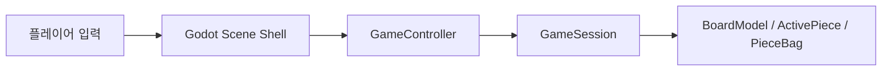
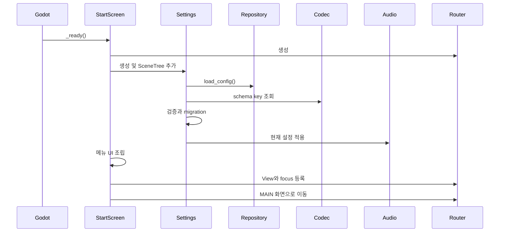
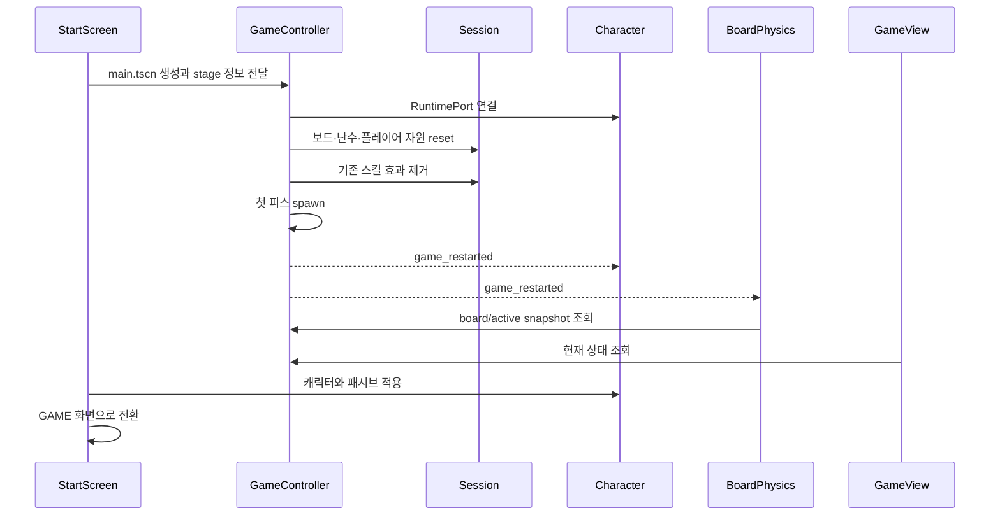
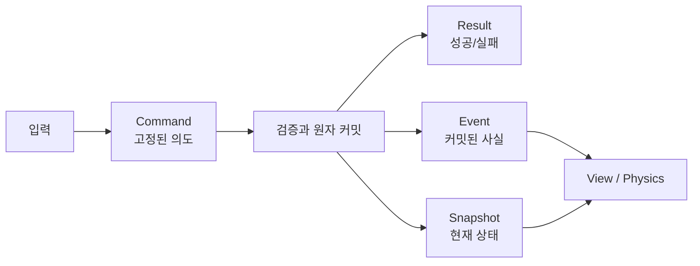
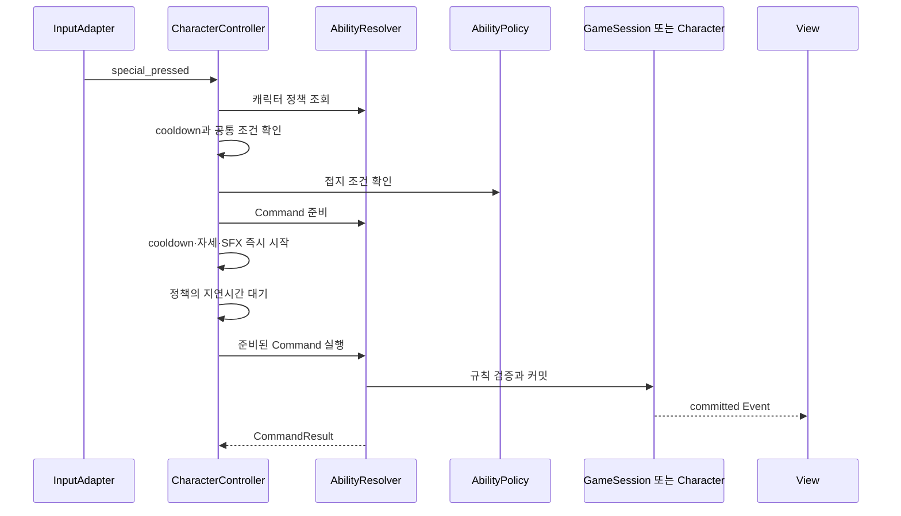
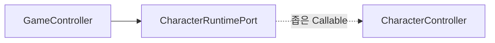
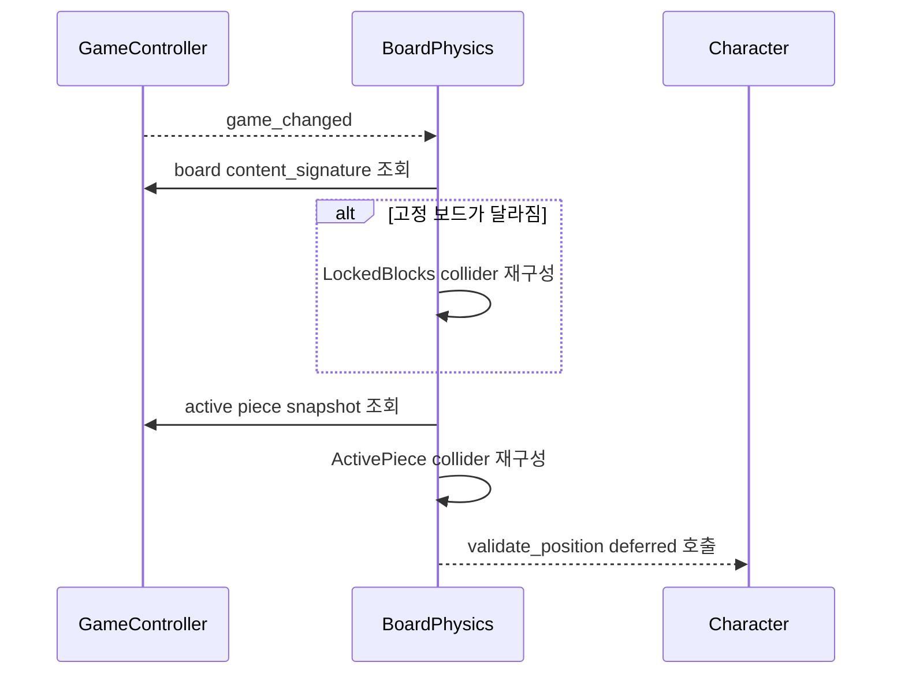
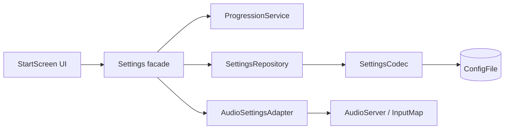
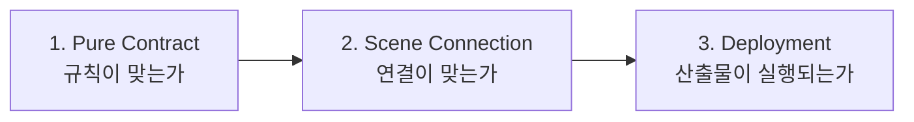

# Block Fighter ver.1.0.2 아키텍처 이해 가이드

> 원본 명세: `docs/FINAL_ARCHITECTURE_KO.md`
> 이 문서의 목적: 원본의 모든 핵심 내용을 **처음 읽는 개발자가 이해하기 쉬운 순서**로 설명한다.

---

## 이 문서를 읽으면 알 수 있는 것

이 자료는 클래스 목록을 외우기 위한 문서가 아니다. 다음 질문에 답할 수 있도록 구성했다.

1. 게임 상태의 진짜 원본은 어디에 있는가?
2. 플레이어 입력은 어떤 과정을 거쳐 실제 상태 변경으로 이어지는가?
3. `Command`, `Result`, `Event`, `Snapshot`은 각각 왜 필요한가?
4. `GameController`, `GameSession`, `CharacterController`, `View`는 어떻게 역할이 다른가?
5. 캐릭터 스킬마다 상태를 변경하는 위치가 왜 다른가?
6. 메뉴·설정·저장·오디오는 게임 규칙과 어떻게 분리되는가?
7. 새 기능을 추가할 때 어느 파일부터 수정해야 하는가?

---

## 1. 5분 안에 이해하는 전체 구조

### 1.1 한 문장 요약

> **Godot Node는 엔진과 연결하고, `GameSession`은 게임 규칙의 원본을 소유하며, 상태 변경은 Command로 요청하고 Event로 알리고 Snapshot으로 화면에 보여준다.**

프로젝트의 핵심 구성은 다음 다섯 개 개념으로 정리할 수 있다.

| 개념 | 역할 | 대표 예시 |
|---|---|---|
| Scene Shell | Godot 엔진과 연결 | `GameController`, `CharacterController`, `GameView` |
| Domain State | 게임 규칙과 상태의 원본 | `GameSession`, `BoardModel`, `ActivePieceState` |
| Command/Result | 상태 변경 요청과 처리 결과 | 스킬 시전, 보드 변경, 설정 변경 |
| Event/Snapshot | 커밋된 사실과 현재 상태 조회 | VFX/SFX, 화면 갱신, collider 재생성 |
| Port/Adapter | 구체 구현 사이의 좁은 연결 | `CharacterRuntimePort`, Audio/Settings adapter |

### 1.2 가장 중요한 의존 방향



화살표는 “앞의 객체가 뒤의 객체를 알고 호출할 수 있다”는 뜻이다.

반대 방향은 허용하지 않는다.

```text
GameSession → GameView                 금지
GameSession → SceneTree/Input/Audio    금지
GameView → Session private state 쓰기  금지
BoardPhysics → 보드 규칙 변경          금지
GameController → Character private 함수 금지
```

이 규칙 덕분에 게임 규칙이 Godot 화면이나 오디오 구현에 끌려다니지 않는다.

---

## 2. 먼저 알아야 할 핵심 용어

### 2.1 Authoritative State

“현재 게임 상태의 진짜 원본”을 뜻한다.

예를 들어 물길이 어느 셀에 있고 몇 초 남았는지는 `GameView`가 아니라 `GameSession`이 소유한다. View가 물길을 그리고 있더라도, 그것은 원본을 화면에 투영한 결과일 뿐이다.

### 2.2 Aggregate

서로 함께 지켜야 하는 상태와 규칙의 묶음이다.

- 보드·활성 피스·점수·기믹은 게임 aggregate 쪽에서 관리한다.
- 캐릭터 몸의 이동·질주·일회성 방어·닌자 투사체는 캐릭터 aggregate 쪽에서 관리한다.

상태를 어디에서 변경할지 결정할 때는 “어느 불변식을 함께 지켜야 하는가?”를 본다.

### 2.3 Projection

원본 상태를 다른 형태로 보여주는 결과다.

- `GameView`: 원본 상태를 화면에 그림
- `BoardPhysics`: 원본 보드를 Godot collider로 변환
- UI label: 점수·생명·cooldown을 문자열과 게이지로 표시

Projection은 삭제하고 다시 만들어도 Snapshot만 있으면 복원되어야 한다.

### 2.4 Invalidation Signal

새 상태 전체를 전달하는 것이 아니라 “상태가 바뀌었으니 다시 읽어라”라고 알리는 signal이다.

- `game_changed`
- `stats_changed`

수신자는 signal payload를 원본처럼 저장하지 않고 발행자에게 최신 Snapshot을 요청한다.

### 2.5 Atomic Commit

관련 상태를 전부 성공시키거나 전부 그대로 유지하는 처리 방식이다.

예를 들어 방패의 셀 목록만 바꾸고 지속시간 변경에 실패하면 잘못된 중간 상태가 생긴다. 따라서 셀·방향·지속시간을 한 번에 검증하고 한 번에 커밋한다.

---

## 3. 실제 Scene 구조

### 3.1 프로그램이 처음 실행될 때

`project.godot`의 시작 Scene은 다음과 같다.

```text
res://start_screen/scenes/start_screen.tscn
```

구조를 단순화하면 다음과 같다.

```text
StartScreen : Control
├─ StartScreenSettings
│  ├─ ProgressionService
│  ├─ SettingsRepository
│  ├─ SettingsCodec
│  └─ AudioSettingsAdapter
├─ MusicManager와 메뉴 SFX
├─ ScreenRouter
├─ 여러 ScreenView
└─ 게임 시작 시 SubViewport 안에 main.tscn 생성
```

`StartScreen`은 메뉴 버튼 연결과 상위 흐름을 조정한다. 화면 전환 상태는 `ScreenRouter`, 진행도 규칙은 `ProgressionService`, 파일 저장은 `SettingsRepository`가 맡는다.

### 3.2 실제 게임 화면

```text
Main : Control                         ← MainGameView
├─ GameController : Node              ← MainGameController
└─ BoardPhysics : Node2D              ← MainBoardPhysics
   ├─ Boundaries : StaticBody2D
   ├─ LockedBlocks : StaticBody2D
   ├─ ActivePiece : AnimatableBody2D
   └─ Character : CharacterBody2D      ← MainCharacterController
      ├─ Collider : CollisionShape2D
      ├─ CrushSensor : ShapeCast2D
      ├─ Sprite : Sprite2D
      ├─ LeftRay : RayCast2D
      └─ RightRay : RayCast2D
```

여기서 구분해야 할 점은 다음과 같다.

| 객체 | 실제 역할 |
|---|---|
| `MainGameView` | 게임을 그리지만 규칙의 원본은 아님 |
| `GameController` | Scene 수명과 `GameSession` 사이의 facade |
| `GameSession` | 한 게임 run의 논리 상태와 규칙 원본 |
| `BoardPhysics` | 논리 보드를 Godot 충돌체로 변환 |
| `CharacterController` | 캐릭터 physics frame과 상태 전환 조정 |

---

## 4. 상태는 누가 소유하는가

아키텍처를 이해하는 가장 빠른 방법은 상태의 소유자를 찾는 것이다.

### 4.1 게임 규칙 상태

| 상태 | 원본 소유자 | 읽는 방법 |
|---|---|---|
| 고정 블록과 얼음 정보 | `GameSession.board_state` / `BoardModel` | Controller query 또는 board snapshot |
| 활성 피스 타입·회전·원점·셀 | `ActivePieceState` | active piece snapshot |
| 다음 피스와 bag | `GameSession.piece_queue` | Controller query |
| spawn·기믹 난수 | `GameSession`의 분리된 RNG | Controller 내부 사용 |
| 점수·레벨·삭제 줄·스테이지 시간 | `GameSession` | progress snapshot/query |
| 보스 HP·씨앗·고드름·기믹 시간 | `GameSession` | Controller query |
| 생명과 cooldown | `GameSession`의 private state | Controller/Character forwarding query |
| 물길·방패·시계공 효과 | `GameSession`의 private state | detached snapshot/value query |

### 4.2 캐릭터 런타임 상태

| 상태 | 원본 소유자 | 이유 |
|---|---|---|
| 위치와 velocity | `CharacterBody2D` + `CharacterMotor` | Godot 물리와 직접 결합됨 |
| 매달림 상태 | `CharacterMotor` | 이동·중력과 함께 관리해야 함 |
| 일반인 질주 | `CharacterController` | 캐릭터 몸의 이동 배율 |
| chef 이동 강화와 1회 방어 | `CharacterController` | 캐릭터 이동·피해 소비 불변식 |
| 닌자 투사체 | `CharacterController` | 매 physics frame 충돌을 검사 |
| 애니메이션 상태 | `CharacterPresenter` | 표현 전용 상태 |

### 4.3 메뉴와 영구 진행 상태

| 상태 | 원본 소유자 |
|---|---|
| 스테이지 별·무피해·재화·패시브 | `ProgressionService` |
| 오디오 percent | `AudioSettingsAdapter` |
| ConfigFile key 규약 | `SettingsCodec` |
| 설정 파일 경로와 load/save | `SettingsRepository` |
| 현재 메뉴 화면 | `ScreenRouter.current_screen` |

### 4.4 자주 생기는 오해

`GameController`에는 기존 Scene과 테스트 호환을 위한 forwarding property가 남아 있다. 그렇다고 Controller property가 별도의 원본인 것은 아니다. 실제 생산 경로의 `GameSession`은 `GameController._session`으로 비공개이며, Controller가 조회와 명령 경계를 제공한다.

---

## 5. 게임 시작은 어떤 순서로 연결되는가

### 5.1 메뉴 초기화



### 5.2 게임 Scene 생성



정확성을 `_ready()` 호출 순서에 맡기지 않는다. 늦게 연결된 View나 Physics도 최신 Snapshot을 읽어 현재 모습을 복원한다.

---

## 6. 매 physics frame에 무슨 일이 일어나는가

`GameController`와 `CharacterController` 모두 physics callback을 갖지만 책임이 다르다.

### 6.1 GameController frame

```text
_physics_process(delta)
├─ restart 입력 처리
├─ pause 입력 처리
├─ 보스 전용 상태 처리
├─ PLAYING 상태가 아니면 종료
├─ 물길과 방패 수명 진행
├─ 시계공 freeze 분기
│  ├─ freeze 시간 감소
│  ├─ 피스 낙하와 lock 정지
│  └─ 기믹·스테이지 시간은 별도 규칙 적용
└─ 일반 진행
   ├─ 명상 배율을 피스용 delta에만 적용
   ├─ 중력과 자동 낙하
   ├─ 낙하 직전 물길 slide
   ├─ lock delay
   ├─ stage gimmick
   └─ stage timer
```

### 6.2 시간축 규칙

| 대상 | 사용하는 시간 | Pause | 시계공 freeze |
|---|---|---|---|
| 피스 중력·lock | 명상 배율이 적용된 `effective_delta` | 정지 | 정지 |
| 물길·방패 | 실제 `delta` | 정지 | 계속 진행 |
| 기믹 | 실제 `delta` | 정지 | future freeze 규칙 적용 |
| 스테이지 제한 시간 | 실제 `delta` | 정지 | 계속 진행 |

### 6.3 CharacterController frame

```text
_physics_process(delta)
├─ InputAdapter.capture() → InputFrame
├─ 게임 상태가 PLAYING이 아니면 정지
├─ 캐릭터 로컬 timer 감소
├─ 닌자 투사체 진행
├─ 속박 상태 처리
├─ 특수기 입력 처리
├─ 자력 재스폰 hold 처리
├─ 명상 처리
├─ 기본 공격 처리
├─ 매달림 또는 일반 이동 분기
└─ 공통 후처리
   ├─ 지연된 punch 판정
   ├─ Presenter에 애니메이션 투영
   └─ 보드 경계와 겹침 검증
```

`CharacterController`는 모든 일을 직접 하는 객체가 아니라 **프레임 처리 순서를 조정하는 객체**다.

---

## 7. Command → Result → Event → Snapshot

이 흐름은 현재 구조의 핵심이다.



### 7.1 Command

입력이 받아들여진 순간의 플레이어 의도를 보관한다.

예시:

- 스킬 ID
- 시전 시작 위치
- 조준 방향
- 최초 대상 셀
- 입력 시점의 후보 셀 복제본

단, 게임 규칙 자체는 Command에 넣지 않는다. 소방관의 최대 3칸과 지속시간 4초는 호출자가 정하는 값이 아니라 `GameRules`가 소유하는 값이다.

### 7.2 Result

`MainCommandResult`는 다음을 반환한다.

- `ok`: 성공 여부
- `code`: 호출자가 안전하게 분기할 코드
- `message`: 진단용 메시지
- `events`: 실제 커밋된 Event 목록

실패 Result의 `events`는 항상 비어 있다.

### 7.3 Event

Event는 **상태 변경이 끝난 뒤의 사실**이다.

예시:

- 스킬이 커밋됨
- 물길이 생성·교체됨
- 효과가 만료·초기화됨
- 닌자 투사체가 충돌함
- 실제로 몇 개의 셀이 변경됨

Event가 발행될 때는 이미 상태가 커밋되어 있어야 한다. Subscriber가 즉시 Snapshot을 다시 읽어도 Event와 일치하는 최종 상태를 봐야 한다.

### 7.4 Snapshot

Snapshot은 “방금 무슨 일이 일어났는가?”가 아니라 “지금 무엇이 존재하는가?”에 답한다.

```text
Snapshot = 현재 상태 복원용
Event    = 한 번의 반응용
```

예를 들어 물길이 생성되면:

- View는 Snapshot에서 물길 셀과 남은 시간을 읽어 계속 그린다.
- Event는 물길 등장 pulse나 SFX를 한 번 시작한다.

View가 생성 Event를 놓쳐도 Snapshot을 읽으면 현재 물길은 정상적으로 보인다. 놓치는 것은 일시적인 pulse뿐이다.

---

## 8. 실패해도 상태가 망가지지 않는 이유

보드 스킬은 다음 순서를 지킨다.

1. Command 구조와 현재 게임 상태를 검증한다.
2. 현재 Board/Character Snapshot으로 전체 후보를 계산한다.
3. 하나라도 실패하면 아무것도 변경하지 않는다.
4. 성공하면 관련 상태를 한 번에 커밋한다.
5. 실제 변경 결과로 Event를 만든다.
6. Event를 발행한다.
7. `game_changed`를 발행한다.
8. Result를 반환한다.

### 8.1 핵심 불변식

- 범위 밖·중복·점유 셀이 하나라도 있으면 Board lock 전체가 실패한다.
- 실패 시 기존 셀과 얼음 metadata가 그대로다.
- 빈 물길·보호벽은 방향 `0`, 남은 시간 `0`이다.
- 실패한 새 cast가 기존 물길이나 방패를 지우지 않는다.
- 효과 교체는 중간의 빈 상태 없이 새 상태로 한 번에 바뀐다.
- 시계공의 두 freeze 값은 함께 생성되고 함께 제거된다.
- 생명과 cooldown은 음수가 될 수 없다.
- 만료와 reset이 겹쳐도 같은 제거 Event를 중복 발행하지 않는다.
- Event·Result·Snapshot이 반환하는 배열은 복제본이다.

---

## 9. 캐릭터 특수 스킬은 어떻게 실행되는가

### 9.1 공통 흐름



입력이 접수되면 cooldown·자세·SFX는 즉시 시작한다. 지연 뒤 세계 상태 검증에 실패해도 cooldown은 환불하지 않는다.

### 9.2 정책 표

| 캐릭터 | 지연 | 접지 필요 | 입력 때 고정하는 값 | 커밋 소유자 |
|---|---:|---:|---|---|
| 일반인 `normal` | 0초 | 아니오 | ability ID | Character |
| 복서 `boxer` | 0.25초 | 아니오 | 위치·방향·전방 후보 | Game + Board |
| 방패병 `shield_guard` | 0.25초 | 아니오 | 위치·방향·세로 후보 | GameSession |
| 소방관 `firefighter` | 0.6초 | 예 | 최초 셀·방향 | GameSession |
| 청소부 `cleaner` | 0.4초 | 예 | 발밑 중심 셀 | Game + Board |
| 성녀/요리사 `chef` | 0.3초 | 아니오 | ability ID | Character |
| 시계공 `clockmaker` | 0.4초 | 아니오 | ability ID | GameSession |
| 닌자 `ninja` | 0.25초 | 아니오 | 발사 위치·행·방향 | Character, impact 시 Game |

### 9.3 스킬별 핵심 차이

#### 일반인

2초 질주 상태는 캐릭터 몸의 이동 배율이므로 `CharacterController`가 소유한다. 만료 시 `ABILITY_CLEARED(EXPIRED)`를 발생시킨다.

#### 복서

입력 시점에는 전방 후보를 고정한다. 0.25초 뒤에는 최신 Board와 현재 캐릭터 collider를 사용해 실제로 밀 수 있는지 다시 검증한다. Event에는 시도한 거리가 아니라 실제 이동량이 들어간다.

#### 방패병

세로 3셀 후보 가운데 최신 Board에서 실제로 사용할 수 있는 셀만 선택한다. 셀·방향·2초 수명을 한 번에 커밋하며, 활성 피스 배치 검사에서 임시 blocker로 사용한다.

#### 소방관

최초 셀과 방향을 입력 때 고정한다. 커밋 시 최신 Board를 따라 아래로 내려가며 최대 3칸을 계산한다. 성공하면 셀·방향·4초를 한 번에 교체한다. 물길은 자동 낙하 직전에 활성 피스를 옆으로 한 번 이동시키려 시도한다.

#### 청소부

중앙→왼쪽→오른쪽 순서로 노출된 고정 블록을 검사한다. `BoardMutationReceipt`에는 실제로 제거된 셀만 기록하며 Event도 그 receipt를 사용한다.

#### 성녀/요리사 슬롯

3초 이동 강화와 1회 방어를 함께 활성화한다. 방어를 소비해도 이동 강화는 남은 시간 동안 유지된다. 캐릭터 이동과 피해 소비 불변식이므로 Character aggregate가 소유한다.

#### 시계공

현재 피스 낙하 freeze와 미래 기믹 freeze를 3초로 함께 만든다. 3초는 호출자가 전달하는 값이 아니라 `GameRules`의 규칙이다.

#### 닌자

투사체는 매 physics frame 최신 Board를 검사한다. 투사체 비행 중 캐릭터가 움직일 수 있으므로, 충돌 금지 셀은 입력 때 저장하지 않고 impact 직전에 현재 collider로 다시 계산한다.

---

## 10. CharacterController는 왜 아직 큰가

이미 여러 책임이 분리되어 있다.

| 구성 요소 | 담당 | 담당하지 않는 것 |
|---|---|---|
| `CharacterController` | physics 순서, 상태 전환, collision query, 로컬 ability commit | 전역 Input 직접 읽기, Sprite 저수준 조작, SFX player 생성 |
| `CharacterInputAdapter` | Godot `Input` 읽기 | 규칙 검증과 이동 |
| `CharacterInputFrame` | 한 frame의 입력 Snapshot | 다음 frame 상태 보관 |
| `CharacterMotor` | 속도·중력·이동·위치 clamp·매달림 | 스킬·점수·보드 변경 |
| `CharacterAbilityResolver` | 캐릭터 ID→정책 연결 | 지속 효과 상태 소유 |
| `CharacterAbilityPolicy` | 지연·접지·Command builder/executor | SceneTree와 렌더링 |
| `CharacterPresenter` | Sprite·atlas·facing·rotation·표시 | gameplay 규칙 |
| `CharacterAudioAdapter` | SFX와 명상 loop | cooldown·피해 판정 |

그런데도 `CharacterController`가 큰 이유는 실제 Godot 충돌과 점프·매달림·압착·재스폰의 상태 전환 순서를 한곳에서 조정해야 하기 때문이다.

추가 분리는 단순히 줄 수가 많다는 이유가 아니라 다음 상황에서 검토한다.

- 매달림 규칙만 독립적으로 자주 변경될 때
- 피해·재스폰 상태 기계가 별도 유형과 함께 커질 때
- collision query를 fake로 바꾼 순수 테스트가 필요할 때

---

## 11. GameController와 Character가 직접 얽히지 않는 방법

`GameController`는 `CharacterController`의 private 함수를 직접 호출하지 않는다. 대신 `MainCharacterRuntimePort`를 사용한다.

```text
MainCharacterRuntimePort
├─ get_max_lives
├─ get_collider_rect
├─ get_bound
├─ apply_binding
├─ take_hazard_damage
└─ clear_local_runtime
```



전체 reset에서도 Port는 Character의 로컬 런타임만 정리한다. 게임 효과는 Controller/Session이 한 번만 제거하므로 순환 호출이 생기지 않는다.

---

## 12. View와 BoardPhysics는 상태를 어떻게 보여주는가

### 12.1 View가 구독하는 주요 Signal

| 발행자 | Signal | View 반응 |
|---|---|---|
| GameController | `game_changed` | 최신 Snapshot 조회, label과 redraw 갱신 |
| GameController | `game_event_committed` | 물길 pulse 등 일시 VFX |
| GameController | `boss_attacked` | 보스 공격·피격 연출 |
| CharacterController | `stats_changed` | 생명·stamina·cooldown UI |
| CharacterController | `ability_event_committed` | 캐릭터 스킬 VFX |
| CharacterController | `binding_started/ended` | 속박 표시 변경 |

`game_changed`와 `stats_changed`는 invalidation signal이다. “새 상태는 이것이다”가 아니라 “최신 값을 다시 조회하라”는 의미다.

### 12.2 BoardPhysics 동기화



고정 보드 signature가 같으면 collider를 불필요하게 다시 만들지 않는다. 충돌체가 갱신된 뒤 Character 위치를 검증한다.

---

## 13. 메뉴·설정·진행도 구조

### 13.1 화면 전환

```text
StartScreen
├─ 화면 Control 생성과 버튼 signal 연결
├─ ScreenRouter.route(screen_id)
│  ├─ current_screen 변경
│  ├─ 기존 View 비활성
│  ├─ GAME이면 game_host 표시
│  └─ 메뉴이면 대상 ScreenView.enter()
└─ ScreenView.enter()
   ├─ root 표시
   ├─ 화면별 refresh callback
   └─ preferred 또는 fallback focus
```

### 13.2 게임 호스팅

```text
StartScreen.start_game()
→ main.tscn 생성
→ stage/challenge 정보 전달
→ character/passive 적용
→ SubViewport에 Game 추가
→ ScreenRouter.route(GAME)
→ 전투 음악 재생
```

게임이 끝나면 Game instance를 제거하고 viewport 크기를 복구한 뒤 메뉴 화면으로 돌아간다.

### 13.3 설정 계층



### 13.4 설정 쓰기 트랜잭션

1. 변경 전 메모리 Snapshot을 보관한다.
2. 새 값을 검증한다.
3. 메모리와 엔진에 새 값을 임시 적용한다.
4. Repository를 통해 디스크에 저장한다.
5. 저장 성공 시 changed signal을 보낸다.
6. 저장 실패 시 메모리·UI·AudioServer를 이전 Snapshot으로 되돌린다.

구성 요소 사이의 책임은 다음처럼 분리된다.

- `SettingsCodec`: section/key와 직렬화 모양만 안다.
- `SettingsRepository`: 파일 경로와 load/save만 안다.
- `ProgressionService`: 별·해금·패시브 규칙을 안다.
- `AudioSettingsAdapter`: percent를 dB/mute로 바꾸고 AudioServer에 적용한다.
- `StartScreenSettings`: 전체 변경을 검증하고 트랜잭션으로 조정한다.

### 13.5 ProgressionService의 규칙

- 10개 스테이지의 최고 별과 무피해 기록
- 별 재화와 최고 기록 차액 보상
- 6종 패시브의 0~3레벨, 비용과 초기화 환불
- 이전 층 완료에 따른 다음 층 해금
- 10층 완료에 따른 도전 모드 해금
- 캐릭터별 누적 별·전체 무피해 해금
- 도전 모드 최고 삭제 줄
- debug 전체 캐릭터 해금

---

## 14. 테스트는 왜 세 계층으로 나뉘는가



### 14.1 Pure Contract

파일: `tests/contracts/pure_contract_test.gd`

```text
before snapshot + command
├─ 성공 → after snapshot과 committed Event가 일치
└─ 실패 → after == before, Event 없음
```

Scene을 생성하지 않고 BoardModel, GameSession, ProgressionService의 규칙을 검증한다.

현재 기준: **55 assertions, failures 0**

### 14.2 Scene Connection

주요 파일:

- `tests/main_game_test.gd`
- `start_screen/tests/main_ui_test.gd`
- `tests/*_runtime_integration_test.gd`
- `start_screen/tests/character_unlock_persistence_test.gd`

검증 대상:

- 실제 Scene path와 export 연결
- InputAdapter → InputFrame → Resolver → Command
- Session commit → Controller signal → View/Physics
- CharacterMotor와 실제 Godot collision
- 시전 지연 중 이동과 방향 변경
- 설정 저장과 재실행 persistence

현재 기준:

- Main game: **281 assertions, failures 0**
- Main UI: **134 assertions, failures 0**
- Runtime integration: **9종 통과**
- Persistence: **failures 0**

### 14.3 Deployment

파일:

- `release.ps1`
- `build_web.sh`

검증 대상:

- Godot import와 script/resource parse
- Web export 필수 파일
- source-only 경로가 없는 ZIP
- HTTP 200
- 브라우저 title·canvas·실제 render
- console과 engine error marker

브라우저 smoke를 생략한 결과는 완전한 `PASS`가 아니라 `PASS_WITHOUT_BROWSER_SMOKE`다.

---

## 15. 새 기능을 추가할 때의 결정 순서

### 15.1 새 캐릭터 스킬

1. 입력 순간 고정해야 할 의도를 Command로 정의한다.
2. Resolver registry에 지연·접지·builder/executor 정책을 등록한다.
3. 변경할 원본의 소유자를 고른다.
   - 캐릭터 이동·방어·투사체: Character aggregate
   - 보드·피스·낙하·기믹: Game aggregate
4. 전체 후보를 계산한 뒤 한 번에 커밋한다.
5. Result와 Event가 같은 커밋 사실을 표현하게 한다.
6. Pure contract와 Scene integration test를 추가한다.

### 15.2 새 Board 변경

1. 부분 실패가 가능한 지점을 찾는다.
2. 실제 변경 셀을 receipt로 반환한다.
3. Event에는 시도한 후보가 아니라 receipt를 기록한다.
4. 셀과 metadata를 함께 커밋한다.

### 15.3 새 메뉴 화면

1. root `Control`을 만든다.
2. `ScreenRouter`에 View를 등록한다.
3. 화면 진입 시 refresh callback을 연결한다.
4. preferred focus와 fallback 후보를 설정한다.
5. `StartScreen`에는 버튼 signal과 상위 flow만 남긴다.

### 15.4 새 설정값

1. 값의 원본 소유자와 유효성 규칙을 정한다.
2. Codec에 section/key를 추가한다.
3. Repository의 I/O 모양을 확장한다.
4. Settings facade에 검증·migration·rollback을 추가한다.
5. 엔진 적용이 필요하면 별도 adapter를 사용한다.

### 15.5 새 VFX/SFX

다음 질문으로 결정한다.

| 질문 | 선택 |
|---|---|
| 현재 상태를 계속 보여줘야 하는가? | Snapshot을 매 draw에 조회 |
| 한 번 일어난 사실에 반응하는가? | committed Event로 시작 |
| 저장·재접속 뒤에도 복원해야 하는가? | authoritative state + Snapshot |
| 과거 순서까지 재현해야 하는가? | 별도 Event log/replay 설계 |

---

## 16. 입력 시점과 커밋 시점 구분법

지연형 스킬에서 가장 중요한 판단이다.

| 값 | 결정 시점 | 이유 |
|---|---|---|
| 조준 방향 | 입력 시점 | 플레이어 의도 |
| 시전 시작 위치 | 입력 시점 | 공격 출발점 |
| 대상이 아직 존재하는가 | 커밋 시점 | 세계 상태가 바뀔 수 있음 |
| 목적지가 비어 있는가 | 커밋 시점 | 충돌 불변식 |
| 캐릭터의 현재 금지 셀 | 커밋 시점 | 캐릭터가 이동할 수 있음 |
| 피해량·지속시간 공식 | 규칙 원본 | 호출자가 조작하면 안 됨 |
| 연출 pulse | Event 수신 시점 | 일시적인 표현 |

이 기준은 복서·소방관·닌자뿐 아니라 대시, 지연 폭발, 함정 설치, 제작, 구매 트랜잭션에도 그대로 적용할 수 있다.

---

## 17. 주요 코드 위치

### 17.1 게임 규칙과 상태

| 영역 | 파일 |
|---|---|
| 공용 규칙 | `scripts/game_rules.gd` |
| Command 결과 | `scripts/command_result.gd` |
| Game Event | `scripts/game_event.gd` |
| 스킬 Command | `scripts/ability_cast_command.gd` |
| 소방관 Command | `scripts/firefighter_cast_command.gd` |
| Session aggregate | `scripts/game_session.gd` |
| Board 원본 | `scripts/board_model.gd` |
| Active piece | `scripts/active_piece_state.gd` |
| Piece queue | `scripts/piece_bag.gd` |
| 실제 변경 receipt | `scripts/board_mutation_receipt.gd` |

### 17.2 Scene과 캐릭터

| 영역 | 파일 |
|---|---|
| Scene facade | `scripts/game_controller.gd` |
| 물리 Projection | `scripts/board_physics.gd` |
| 게임 View | `scripts/game_view.gd` |
| 캐릭터 shell | `scripts/character_controller.gd` |
| 입력 adapter/frame | `scripts/character_input_adapter.gd`, `character_input_frame.gd` |
| 이동 | `scripts/character_motor.gd` |
| 스킬 registry/policy | `scripts/character_ability_resolver.gd`, `character_ability_policy.gd` |
| 준비된 스킬 | `scripts/prepared_character_ability.gd` |
| Character Port | `scripts/character_runtime_port.gd` |
| 캐릭터 표현과 오디오 | `scripts/character_presenter.gd`, `character_audio_adapter.gd` |
| 닌자 View Snapshot | `scripts/ninja_projectile_snapshot.gd` |

### 17.3 메뉴와 설정

| 영역 | 파일 |
|---|---|
| StartScreen shell | `start_screen/scripts/start_screen.gd` |
| 화면 Router/View | `start_screen/scripts/screen_router.gd`, `screen_view.gd` |
| Settings facade | `start_screen/scripts/start_screen_settings.gd` |
| 진행도 | `start_screen/scripts/progression_service.gd` |
| 저장소와 schema | `start_screen/scripts/settings_repository.gd`, `settings_codec.gd` |
| 오디오 설정 | `start_screen/scripts/audio_settings_adapter.gd` |

---

## 18. 현재 구조의 장점과 비용

### 장점

1. 실패한 스킬이 기존 효과를 지우는 부분 커밋을 막는다.
2. 상태와 Event payload가 같은 사실을 표현한다.
3. View와 Physics를 삭제해도 Snapshot으로 복원할 수 있다.
4. Input·난수·ConfigFile·AudioServer가 게임 규칙 안으로 침투하지 않는다.
5. 새 캐릭터를 추가할 때 거대한 `match`를 계속 키우지 않는다.
6. 저장 실패 시 메모리와 UI만 성공 상태로 남지 않도록 rollback한다.
7. 규칙·Scene 연결·배포 오류를 서로 다른 테스트 계층에서 찾는다.
8. 기존 API를 호환 facade로 유지해 전면 재작성 위험을 낮춘다.

### 비용과 남은 경계

- `CharacterController`에는 Godot 충돌과 복잡한 상태 전환 순서가 남아 있다.
- `GameController`에는 기존 사용처를 위한 forwarding property가 많다.
- `StartScreen`에는 화면별 UI builder가 남아 있다.
- GDScript `Callable`은 완전한 컴파일 타임 타입 안전성을 제공하지 않는다.
- 배열을 복제하는 Snapshot은 안전하지만 할당 비용이 있다.

현재 10×22 보드와 작은 스킬 셀 목록에서는 복제 비용보다 alias 오염을 방지하는 편이 중요하다.

---

## 19. 코드 리뷰 체크리스트

새 기능이나 리팩터링을 검토할 때 다음을 확인한다.

- [ ] 원본 상태의 소유자가 하나인가?
- [ ] 함께 지켜야 하는 값이 같은 aggregate 또는 Command에 있는가?
- [ ] 입력 의도와 커밋 시점의 세계 상태를 구분했는가?
- [ ] 상태를 바꾸기 전에 전체 후보를 계산했는가?
- [ ] 실패하면 이전 Snapshot과 Event 수가 그대로인가?
- [ ] 상태를 먼저 커밋하고 Event를 나중에 발행하는가?
- [ ] Event가 시도값이 아닌 실제 변경 결과를 담는가?
- [ ] View가 Event payload를 장기 원본으로 저장하지 않는가?
- [ ] View와 Physics가 Snapshot만으로 복원 가능한가?
- [ ] Input·시간·난수·저장·오디오가 작은 경계 뒤에 있는가?
- [ ] reset·만료·교체가 중복 제거 Event를 막는가?
- [ ] Pure·Scene·Deployment 테스트를 각각 추가했는가?

---

## 20. 최종 정리

이 프로젝트의 아키텍처는 다음 네 문장으로 기억하면 된다.

1. **`GameSession`은 한 게임 run의 논리 원본이다.**
2. **`GameController`와 `CharacterController`는 서로 다른 불변식의 커밋 경계다.**
3. **Event는 성공한 커밋을 알리고, View와 Physics는 Snapshot으로 현재 상태를 복원한다.**
4. **Input·Scene·ConfigFile·AudioServer·Web export는 게임 규칙 바깥의 adapter와 검증 계층에 둔다.**

이 구조는 완전한 ECS도, 완전한 Event Sourcing도 아니다. 현재 게임의 크기와 Godot 물리 특성에 맞춰 **규칙의 결정성**, **Scene의 실용성**, **점진적 리팩터링 가능성**을 함께 확보한 구조다.
